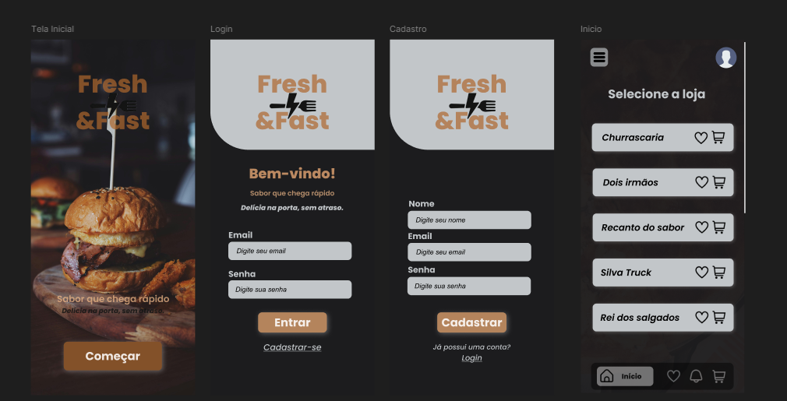

<h1 style="text-align: center;">Fresh&Fast</h1>

Um sistema de melhoria de empreendimento local, relacionado ao mercado alimentício

---

<h2 style="text-align: center;">Layout do projeto</h2>

<h2 style="text-align: center;">Funcionalidades</h2>
<ul>
    <li>Cadastro de estabelecimentos e seus produtos</li>
    <li>Carrinho de compras com histórico de pedidos</li>
    <li>Listagem de produtos marcados como favoritos</li>
    <li>Edição dos dados do usuário</li>
</ul>

<h2 style="text-align: center;">Tecnologias utilizadas</h2>
<ul>
    <li>HTML</li>
    <li>CSS</li>
</ul>

<h2 style="text-align: center;">Colaboradores</h2>
<ul>
    <li>João Pedro</li>
    <li>Pablo Haimar</li>
    <li>Gabriel Lima</li>
    <li>Matheus Macena</li>
</ul>
